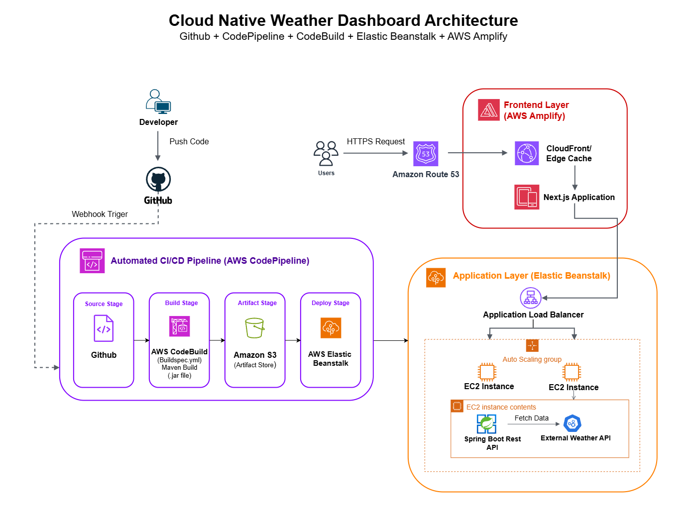

# AWS Cloud-Native Weather Platform (Backend)

This repository contains the Java Spring Boot REST API that serves as the backend application layer for the AWS Cloud-Native Weather Dashboard. The application is designed for high availability and automated scaling, leveraging enterprise-grade AWS infrastructure to securely fetch, process, and serve weather data.

> **Frontend Architecture:** The server-side rendered Next.js frontend is hosted on AWS Amplify and interfaces securely with this API. 
> 🔗 **Frontend Repository:** https://github.com/Thinal2004/Weather-Dashboard-frontend
 

## 🏗 Cloud Architecture & Infrastructure

The application deployment is fully managed by AWS Elastic Beanstalk, which provisions the necessary EC2 instances and automatically handles underlying capacity, scaling, and application health monitoring. 

*   **Traffic Management:** An Application Load Balancer (ALB) serves as the single entry point, handling SSL/TLS termination and distributing ingress HTTPS traffic across the active compute instances.
*   **Auto Scaling Group (ASG):** The backend dynamically scales EC2 instances out and in based on real-time traffic volume and CPU utilization, ensuring cost efficiency during low-traffic periods and fault tolerance during spikes.
*   **Internal Routing:** Within the EC2 environment, Elastic Beanstalk utilizes Nginx as a local reverse proxy to route public traffic from port 80 directly to the embedded Spring Boot Tomcat server running on port 5000.
*   **Observability:** Application telemetry, including JVM metrics, Nginx access logs, and application standard output, is streamed continuously to Amazon CloudWatch for centralized monitoring and alerting.

 

  

 

 

## 🚀 CI/CD Pipeline

To ensure rapid, zero-downtime releases, this repository is connected to a fully automated continuous integration and continuous deployment (CI/CD) pipeline:
1.  **Source:** GitHub webhooks trigger AWS CodePipeline upon every merge to the main branch.
2.  **Build:** AWS CodeBuild compiles the Java source code and packages the executable `.jar` file using Maven.
3.  **Artifact Store:** The compiled `.jar` is securely stored in an Amazon S3 bucket.
4.  **Deploy:** CodePipeline deploys the new artifact from S3 to the Elastic Beanstalk environments automatically.

 

## ☁️ AWS Services Used

This platform is built entirely on AWS, utilizing a mix of compute, networking, and CI/CD services to ensure enterprise-level performance and deployment automation.

*   **AWS Elastic Beanstalk** 
*   **Application Load Balancer** 
*   **Auto Scaling Group** 
*   **AWS CodePipeline** 
*   **AWS CodeBuild** 
*   **Amazon S3**
*   **Amazon CloudWatch** 
*   **Amazon Route 53** 
*   **AWS Amplify**

